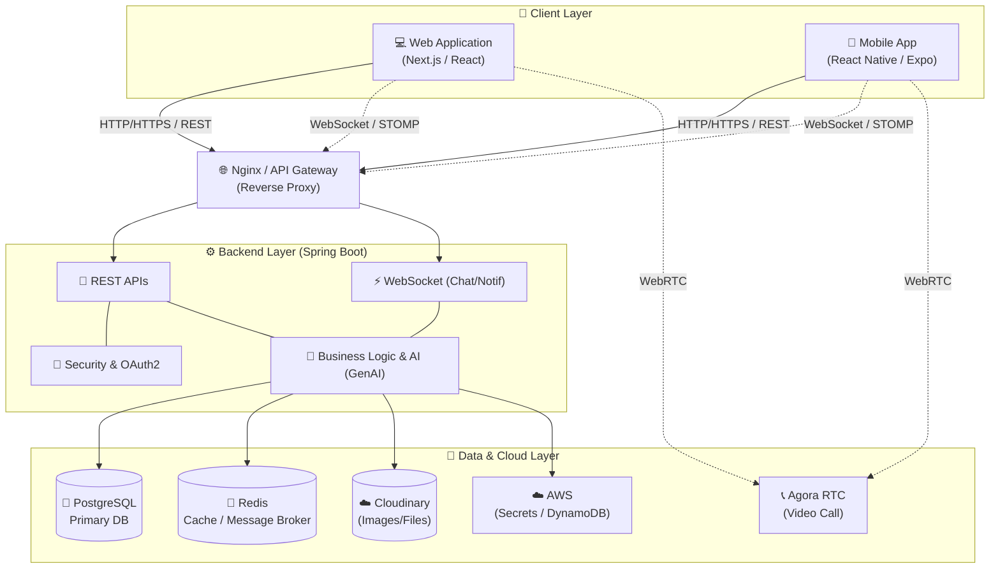

# 🐐 Goat - JobHunter

Goat JobHunter là một nền tảng tìm kiếm việc làm toàn diện, kết nối ứng viên và nhà tuyển dụng một cách nhanh chóng và hiệu quả. Hệ thống được xây dựng với kiến trúc hiện đại, hỗ trợ đa nền tảng (Web & Mobile) cùng với các tính năng thời gian thực và tích hợp AI.

---

## 🌟 1. Mô tả các chức năng của hệ thống & Công cụ hỗ trợ

### 🚀 Chức năng chính
* **Quản lý tài khoản & Phân quyền:** Đăng nhập/Đăng ký qua Email, OAuth2. Hỗ trợ các vai trò: Ứng viên (Candidate), Nhà tuyển dụng (Employer), và Quản trị viên (Admin).
* **Quản lý Hồ sơ/CV:** Ứng viên có thể tạo, tải lên và quản lý CV thông qua nền tảng đám mây.
* **Tìm kiếm & Lọc việc làm:** Tìm kiếm việc làm nâng cao theo từ khóa, địa điểm, mức lương, ngành nghề.
* **Quản lý Tuyển dụng:** Nhà tuyển dụng có thể đăng bài tuyển dụng, quản lý hồ sơ ứng tuyển, và lên lịch phỏng vấn.
* **Tương tác thời gian thực:** Trò chuyện trực tiếp (Chat) giữa nhà tuyển dụng và ứng viên, hệ thống thông báo (Notification) qua WebSocket.
* **Phỏng vấn trực tuyến:** Tích hợp gọi Video/Audio (thông qua Agora RTC).
* **AI Hỗ trợ:** Sử dụng Google GenAI để gợi ý việc làm phù hợp, hỗ trợ viết CV hoặc phân tích mô tả công việc một cách thông minh.

### 🛠 Công cụ & Công nghệ sử dụng

Hệ thống sử dụng các công nghệ tiên tiến nhất để đảm bảo hiệu suất và trải nghiệm người dùng:

* **Backend (Spring Boot):**
  * **Core:** Java 21, Spring Boot 3.5, Spring Security, OAuth2.
  * **Database:** PostgreSQL (Lưu trữ dữ liệu chính), Liquibase (Quản lý version database schema).
  * **Caching & Real-time:** Redis, WebSocket (STOMP).
  * **Cloud & Storage:** AWS SDK (DynamoDB, Secrets Manager), Cloudinary (Lưu trữ hình ảnh/CV).
  * **AI & Utils:** Google GenAI SDK, Datafaker, JavaMailSender.
  * **API Docs:** SpringDoc (Swagger).

* **Frontend (Web Application):**
  * **Core:** Next.js 16, React 19, TypeScript.
  * **State Management:** Redux Toolkit, Redux Persist.
  * **UI/UX:** Tailwind CSS 4, Radix UI, Framer Motion, Ant Design.
  * **Form & Validation:** React Hook Form, Zod.
  * **Real-time & Video:** SockJS, StompJS, Agora RTC SDK.

* **Mobile (Ứng dụng di động):**
  * **Core:** React Native 0.81, Expo (với Expo Router).
  * **UI/UX:** React Native Paper, Reanimated, Gesture Handler.
  * **Real-time & Video:** SockJS, StompJS, Agora React Native.

---

## 🏗 2. Sơ đồ kiến trúc hệ thống (Architecture Diagram)

Sơ đồ dưới đây mô tả cách các thành phần trong hệ thống giao tiếp với nhau:



---

## 🐳 3. Hướng dẫn cài đặt bằng `docker-compose` từng bước một

Để triển khai toàn bộ hệ thống ở môi trường local một cách nhanh chóng, bạn có thể sử dụng Docker Compose. 

### Bước 1: Yêu cầu hệ thống
* Cài đặt **[Docker Desktop](https://docs.docker.com/get-docker/)** và đảm bảo Docker đang chạy.
* Cài đặt **Git** (để tải mã nguồn).

### Bước 2: Clone mã nguồn
Mở terminal và chạy lệnh:
```bash
git clone <đường-dẫn-repo-của-bạn> goat-jobhunter
cd goat-jobhunter
```

### Bước 3: Cấu hình biến môi trường (.env)
Tạo một file `.env` tại thư mục gốc (root) của dự án. File này sẽ chứa các thông tin cấu hình cho Database, Redis và các API Keys. 
*(Nếu có sẵn file `.env.example`, bạn có thể đổi tên thành `.env`)*.

Ví dụ nội dung file `.env`:
```env
# Cấu hình PostgreSQL
POSTGRES_USER=postgres
POSTGRES_PASSWORD=secret
POSTGRES_DB=goat_db

# Cấu hình Redis
REDIS_PASSWORD=redis_secret

# Các khóa dịch vụ bên thứ 3 (Thay bằng khóa thực tế của bạn)
CLOUDINARY_URL=cloudinary://<your_key>:<your_secret>@<your_cloud_name>
GOOGLE_GENAI_API_KEY=your_genai_key
AGORA_APP_ID=your_agora_app_id
```

### Bước 4: Khởi chạy hệ thống bằng Docker Compose
Đảm bảo bạn đang ở thư mục gốc chứa file `docker-compose.yml`, chạy lệnh sau để build và khởi động tất cả các container ở chế độ chạy ngầm (detached mode):

```bash
docker-compose up -d --build
```

**Quá trình này sẽ thực hiện:**
1. Tải các Docker image cần thiết như PostgreSQL, Redis.
2. Build image cho **Backend** (Spring Boot).
3. Build image cho **Frontend** (Next.js).
4. Khởi tạo network nội bộ và liên kết các container lại với nhau.

### Bước 5: Kiểm tra trạng thái
Bạn có thể kiểm tra xem tất cả các services đã hoạt động thành công hay chưa bằng lệnh:
```bash
docker-compose ps
```
Để xem log chi tiết của một service (ví dụ backend) nhằm đảm bảo không có lỗi khởi động:
```bash
docker-compose logs -f backend
```

### Bước 6: Truy cập ứng dụng
Sau khi hệ thống đã khởi động hoàn tất, bạn có thể trải nghiệm ứng dụng tại:
* **Frontend Web:** [http://localhost:3000](http://localhost:3000)
* **Backend API:** `http://localhost:8080/api`
* **Swagger API Docs:** [http://localhost:8080/swagger-ui.html](http://localhost:8080/swagger-ui.html)

### 🛑 Hướng dẫn dừng hệ thống
Khi bạn muốn dừng ứng dụng, sử dụng lệnh:
```bash
docker-compose down
```
*(Lưu ý: Nếu bạn muốn xóa luôn dữ liệu database trong volume, hãy thêm cờ `-v`: `docker-compose down -v`)*
